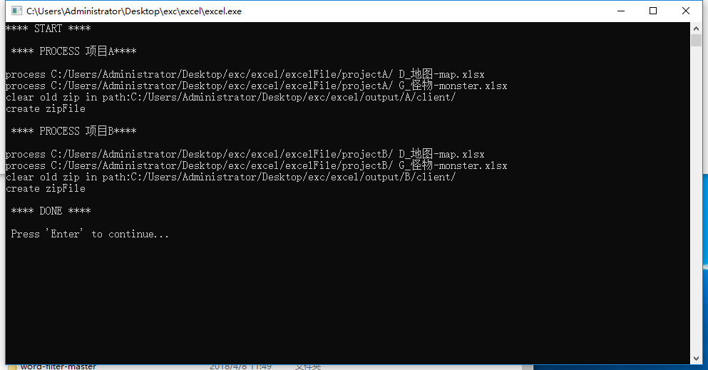

excel转json
支持服务器端和客户端
服务器端：生成的是标准JSON
客户端：生成的是阉割版的,表头+数据的方式

config.json
{
  "data":[
    {
      "name":"内网165",
      "inPath":"C:/Users/Administrator/Desktop/new_svn/shuzhi/数据表/",
      "serverOutPath":"C:/Users/Administrator/Desktop/new_svn/a/out1/s/",
      "clientOutPath":"C:/Users/Administrator/Desktop/new_svn/a/out1/c/",
      "clientZip":1
    }
  ,
    {
      "name":"公网181",
      "inPath":"C:/Users/Administrator/Desktop/new_svn/shuzhi/数据表/",
      "serverOutPath":"C:/Users/Administrator/Desktop/new_svn/a/out2/s/",
      "clientOutPath":"C:/Users/Administrator/Desktop/new_svn/a/out2/c/",
      "serverZip":1
    }
  ]
}

name：平台标志
inPath：excel目录
serverOutPath：服务器端生成json路径
clientOutPath：客户端生成json路径
[clientZip]：客户端是否打个ZIP包,1打包，0不打包. 此配置可选，删除此配置默认为不打包
serverZip:服务器是否打包，同上